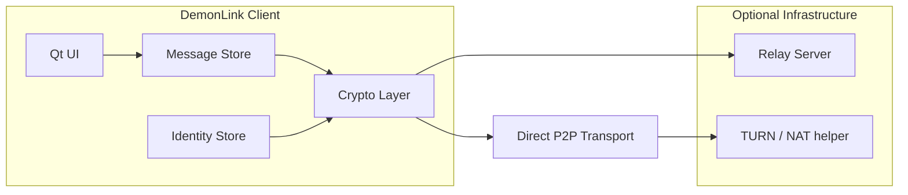

# DemonLink — E2EE Messaging Architecture

DemonLink is a **separate application** from GrimLedger. GrimLedger remains a local-first encrypted vault and password manager. DemonLink owns real-time and asynchronous messaging, identity, and contact graph features.

## Design principles

1. **Separation of concerns** — Vault secrets never leave GrimLedger. DemonLink may import *contact public keys* or *GrimShare envelopes*, but not the master vault key.
2. **End-to-end encryption** — Message plaintext is encrypted client-side before any relay sees it.
3. **Local-first** — Offline read/write of cached threads; sync when a relay or peer is reachable.
4. **Minimal trust in servers** — A relay stores only ciphertext, routing metadata, and delivery receipts.
5. **Shared offline format with GrimLedger** — GrimShare export bundles (Stage B) use the same authenticated envelope format for file handoff between apps.

## High-level components



| Component | Responsibility |
|-----------|----------------|
| Identity Store | Long-term signing key + X25519 agreement key; device pre-keys |
| Message Store | Encrypted SQLite (or SQLCipher) for threads, drafts, attachments |
| Crypto Layer | Double Ratchet or Noise-based session; AEAD per message |
| Relay (optional) | Store-and-forward ciphertext; no decryption |
| P2P Transport | QUIC or WebRTC data channel for direct delivery when online |

## Identity model

Each user has:

- **Display identity** — Human-readable name + optional DemonTag (`@alice:grim`)
- **Signing key** — Ed25519 for message authenticity
- **Agreement key** — X25519 for session establishment
- **Device keys** — One-time pre-keys rotated on unlock

Public keys are distributed via:

1. QR / safety-number verification out of band
2. Optional relay directory (public keys only)
3. GrimShare contact cards exported from GrimLedger or DemonLink

Private keys live in DemonLink's encrypted store, wrapped by a user passphrase or platform secure enclave — **not** the GrimLedger master password.

## Message envelope

```
DMLK1 | sender_id | recipient_id | ratchet_header | ciphertext | auth_tag
```

- **Version** `DMLK1` — protocol version
- **ratchet_header** — Double Ratchet or Noise handshake state
- **ciphertext** — XChaCha20-Poly1305 (libsodium) over UTF-8 body + attachment refs
- **Associated data** — `sender_id || recipient_id || message_id || timestamp`

Attachments are separate AEAD blobs referenced by `grim://demonlink/attachment/<id>` URLs inside the message body, mirroring GrimLedger's attachment pattern.

## Session establishment (Signal-style sketch)

1. Alice fetches Bob's pre-key bundle (direct or via relay).
2. Alice runs X3DH / Noise IK to derive initial root key.
3. Double Ratchet advances per message; out-of-order delivery tolerated via skipped-key cache.
4. Safety number = hash of identity keys; user confirms in UI before first send.

## Transport modes

### Mode A — Relay-assisted (default for mobile/NAT)

- Client opens TLS connection to relay with mutual auth (client cert or token).
- Upload: `POST /v1/messages` with ciphertext blob + recipient routing id.
- Download: long-poll or WebSocket push of pending envelopes.
- Relay retention: configurable TTL (e.g. 30 days), size caps per mailbox.

### Mode B — Direct P2P (optional)

- After relay introduces endpoints, clients attempt QUIC direct.
- STUN/TURN only for NAT traversal; TURN relays encrypted UDP, cannot read payload.
- Falls back to relay when direct path fails.

### Mode C — Offline GrimShare handoff

- Export encrypted thread slice or single message as `.grimshare` file.
- Transfer via USB, email, or GrimLedger note attachment.
- Recipient DemonLink imports and acknowledges in-thread.

## Trust and verification UI

- **Verified contacts** — Safety number confirmed; MITM warnings if keys change
- **Blocked contacts** — Drop envelopes at decrypt boundary
- **Disappearing messages** — Per-thread TTL; timer starts at recipient decrypt
- **Sealed sender (phase 2)** — Relay routes without learning sender id (optional)

## Relationship to GrimLedger

| Feature | GrimLedger | DemonLink |
|---------|------------|-----------|
| Passwords / TOTP | Yes | No |
| Encrypted notes | Yes | No |
| Browser autofill bridge | Yes | No |
| E2EE chat | No | Yes |
| Contact graph / presence | No | Yes |
| GrimShare file export | Yes (bundles) | Yes (import/export) |

GrimLedger may expose a **read-only hook** to copy a GrimShare bundle to disk. DemonLink never requests vault unlock.

## Security requirements

- Master keys and TOTP seeds **must not** enter DemonLink memory space.
- Relay compromise reveals metadata (who talks to whom, sizes, timing) — document this clearly.
- Forward secrecy via ratchet; break-in recovery via periodic re-key prompts.
- Self-destruct / panic wipe independent of GrimLedger settings.
- All network features opt-in; default install is offline-only + GrimShare.

## Suggested implementation phases

### Phase 1 — Local-only threads
- Identity generation, encrypted local DB, GrimShare import/export
- No relay; USB/file transfer only

### Phase 2 — Relay MVP
- TLS relay, mailbox per device, push notifications
- 1:1 text messages, read receipts

### Phase 3 — Rich messaging
- Attachments, reactions, sealed sender, multi-device sync

### Phase 4 — Groups
- Sender Keys or MLS for group channels
- Moderation tools local to each client

## Tech stack alignment

Reuse GrimLedger building blocks where sensible:

- Qt 6 UI shell
- libsodium AEAD + key exchange
- SQLite with same migration discipline
- CMake + ctest security regression suite
- Similar Settings / health dashboard patterns

Do **not** share a single process with GrimLedger; optional shared library crate for crypto primitives only.

## Open decisions

1. Relay self-host vs managed service
2. Double Ratchet vs Noise XX for session wire format
3. Whether to support federation (Matrix bridge) in v2
4. Mobile clients — share core C++ library via FFI

---

*DemonLink is the messaging product line. GrimLedger is the vault. Keep them separable in repo layout (`DemonLink/` sibling project) even if they share CI templates.*
