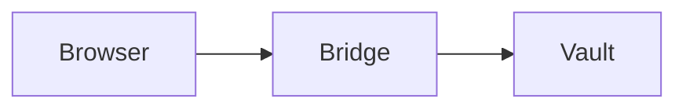

# GrimLedger Future Feature Concepts

## Scope

This document is based on a read-only review of the current GrimLedger codebase. No source code or existing project files were changed.

The existing roadmap already covers many expected improvements such as note history, trash, templates, backlinks, TOTP, richer credential types, browser filling, import/export, biometrics, multiple vaults, and synchronization. The concepts below intentionally focus on more distinctive features that are not already described there.

## Current Product Shape

The current architecture gives GrimLedger several useful foundations:

- Notes are stored as encrypted title and body fields in SQLite.
- Credentials are encrypted field by field and can be released to the browser only after origin matching and desktop confirmation.
- Markdown is rendered by an internal renderer with code fences, syntax highlighting, task lists, links, and encrypted attachments.
- Search currently operates over unlocked note data using straightforward title, tag, and body matching.
- The vault is local-first, with a short-lived in-memory session key and explicit lock behavior.

Future features should preserve those strengths. In particular:

- Plaintext should exist only while the vault is unlocked and only where it is required.
- Features must not imply stronger guarantees than a local desktop application can provide.
- New indexes, previews, logs, and caches must be treated as potentially sensitive data.
- Browser features should use narrow, authenticated actions rather than turning the bridge into a general-purpose API.

## Recommended Features

### 1. Sealed Blocks Inside Notes

Allow a note to contain individually hidden sections for API keys, recovery codes, personal details, or sensitive commands. A sealed block would appear as a labeled placeholder until the user deliberately reveals it.

Example authoring concept:

```text
:::sealed Production API token
the-sensitive-value
:::
```

The stored Markdown should contain an encrypted block reference rather than the plaintext value.

**Why it fits**

GrimLedger currently forces a choice between putting information in a normal note or creating a separate credential. Sealed blocks would connect those two worlds without exposing secrets in note previews, full-text search, or normal rendering.

**Useful behavior**

- Reveal one block without revealing every secret in the note.
- Automatically hide it again after a short timeout or when focus changes.
- Copy with timed clipboard clearing.
- Exclude sealed content from search, previews, exports, and printing by default.
- Allow a sealed block to reference an existing credential field without duplicating the secret.

**Security boundary**

This is mainly an exposure-control feature. If sealed blocks use the same unlocked master-key hierarchy, they do not protect against compromise of the unlocked application process. They do reduce accidental display, indexing, copying, and export.

**Likely impact**

New encrypted block storage, Markdown parser hooks, reveal controls in the preview, and explicit export rules.

**Effort:** Large

### 2. Guided Runbook Sessions

Turn a Markdown checklist into a temporary guided workflow for incident response, system setup, security labs, deployment, or troubleshooting.

Starting a runbook session could:

- Present one step at a time.
- Track completion, skipped steps, notes, and elapsed time.
- Capture screenshots or files as evidence for individual steps.
- Create a final session report without modifying the original runbook.
- Resume an interrupted session after unlocking the vault.

**Why it fits**

GrimLedger already understands task-list Markdown and highlights many shell and programming languages. Runbook mode would turn those static capabilities into a practical workflow tool, especially for cybersecurity students and technical users.

**Safe first version**

The first version should never execute commands. It should provide copy buttons, warnings, parameter placeholders, and evidence capture. Automatic command execution would create a much larger security boundary and should be treated as a separate future project.

**Likely impact**

A runbook parser layered over Markdown, encrypted session records, a step-focused UI, and report generation.

**Effort:** Medium

### 3. Encrypted Browser Web Clipper

Extend the browser extension so the user can deliberately capture selected text, a page title, the current URL, or a screenshot into a new encrypted note.

**Suggested flow**

1. The user selects content and chooses "Clip to GrimLedger."
2. The extension sends metadata and a short preview through a dedicated authenticated bridge action.
3. GrimLedger displays a desktop confirmation with the destination folder and tags.
4. The desktop application sanitizes the content and encrypts it into the vault.

**Why it fits**

The authenticated local bridge and desktop approval flow already exist for credential filling. A clipper would expand the browser integration into note capture while keeping the desktop application in control.

**Security requirements**

- Never capture cookies, form values, hidden fields, or an entire page automatically.
- Strip scripts, event handlers, remote resources, and unsafe HTML.
- Prefer clean Markdown or plain text over storing arbitrary page HTML.
- Require a separate setting from credential filling.
- Apply strict request-size and attachment-size limits.
- Keep clipping and credential actions as separate protocol capabilities.

**Effort:** Medium to Large

### 4. Evidence Casebook Mode

Add an optional mode for research and incident notes that records provenance for attachments and captured material.

Each evidence item could include:

- SHA-256 hash calculated at import.
- Original filename and size.
- Source URL or user-entered source description.
- Local acquisition time.
- An encrypted note explaining how it was obtained.
- A history of annotations without altering the original item.

Casebooks could be exported as a signed bundle containing the evidence, report, and manifest.

**Why it fits**

GrimLedger already stores encrypted attachments and is aimed at technical and security-oriented note taking. Provenance would make it much more useful for labs, investigations, malware analysis notes, and research archives.

**Security and accuracy**

A hash proves that a file has not changed since it was imported. It does not prove that the file was authentic when imported. A local timestamp is also not a trusted external timestamp. The UI should state these limits clearly.

**Likely impact**

Attachment metadata extensions, immutable evidence records, manifest export, and optional signing-key management.

**Effort:** Large

### 5. Local Knowledge Graph

Provide an interactive graph of relationships among notes, folders, tags, attachments, websites, and credentials.

Possible relationships include:

- Explicit note links.
- Shared tags.
- Note-to-credential references.
- Notes created from the same website.
- Runbooks that produced a casebook item.
- Attachments referenced by multiple derived notes.

**Why it fits**

The current data model is organized into separate useful objects, but the user cannot see how they connect. A graph would make GrimLedger feel like a technical knowledge system rather than only a note list.

**Privacy design**

- Build the graph only while unlocked.
- Do not write plaintext graph labels to an external cache.
- Allow relationship types to be hidden.
- Avoid automatically inferring sensitive relationships unless the user enables it.

An MVP could start with explicit links and shared tags, then add richer encrypted relationship records later.

**Effort:** Medium to Large

### 6. Local Secret Scanner and Migration Assistant

Scan unlocked notes for likely secrets and offer to move them into credentials or sealed blocks.

Detection could cover:

- Private key headers.
- Common API-token formats.
- Cloud access keys.
- Connection strings with embedded passwords.
- High-entropy strings near words such as `token`, `secret`, or `password`.
- Recovery-code lists.

**Why it fits**

Users will inevitably paste secrets into notes. GrimLedger already has a safer credential store, but currently provides no path for finding and migrating those values.

**Important behavior**

- Run only on demand or during an explicitly enabled local health check.
- Show why a value was flagged.
- Never send samples to an online service.
- Replace migrated text with a safe credential reference or sealed-block placeholder.
- Support false-positive suppression without storing the original secret in settings.

**Security caution**

Detection is heuristic. The feature should be presented as assistance, not proof that a note is safe.

**Effort:** Medium

### 7. Safe Redaction Studio

Create a sharing view that produces a redacted copy of a note or casebook without changing the encrypted original.

It could detect and visually mark:

- Passwords and token-like values.
- Email addresses and phone numbers.
- IP addresses, hostnames, and URLs.
- User-selected names or project terms.
- Credential references and sealed blocks.
- Attachment metadata.

The user would approve every redaction in a side-by-side preview before export.

**Why it fits**

Encrypted local notes are often eventually turned into reports, support messages, coursework, or documentation. Redaction would make that handoff safer and more deliberate.

**Security requirements**

- Never claim that automatic redaction is complete.
- Flatten or sanitize exported metadata where applicable.
- Make the export destination and included attachments explicit.
- Keep the redacted artifact separate from the original note.

**Effort:** Medium

### 8. Local Diagram Blocks

Render fenced diagram blocks such as Mermaid-style flowcharts, sequence diagrams, state machines, and simple network maps directly in note preview.

Example:

````text

````

**Why it fits**

The custom Markdown renderer already recognizes fenced code languages. Diagram blocks are a natural extension and would be especially useful for architecture notes, threat models, attack paths, and runbooks.

**Implementation direction**

Prefer a local parser and renderer with no network access. If a JavaScript renderer is used, isolate it from the filesystem and network, disable arbitrary HTML, and limit graph size to prevent resource exhaustion.

**Effort:** Small to Medium

### 9. Air-Gapped GrimShare Packages

Allow selected notes, credential fields, or recovery codes to be transferred through an encrypted `.grimshare` package or a sequence of QR codes.

Possible modes:

- Encrypt to a one-time passphrase.
- Encrypt to another GrimLedger installation's public key.
- Split a small payload across numbered QR frames.
- Import into a quarantine preview before committing it to the vault.

**Why it fits**

This would provide a useful sharing path for machines that should not use cloud synchronization, email, or removable plaintext files.

**Security constraints**

- QR data must always be encrypted; never place raw credentials in a QR code.
- Display the receiving identity and payload type before export.
- Treat expiry and "one-time use" as advisory once the recipient has decrypted the data.
- Rate-limit passphrase attempts and use a memory-hard KDF.
- Cap QR payload size and reserve it for small records.

**Effort:** Large

### 10. Private Semantic Search

Offer optional meaning-based search using a local embedding model, so queries such as "notes about failed SSH access" can find relevant material even when those exact words are absent.

**Why it fits**

The current search implementation is intentionally simple and works on literal matches. Semantic search would be a substantial upgrade for large technical vaults.

**Privacy model**

- The model must run locally.
- Model download should be explicit and separate from vault data.
- The user should be told that the local model process receives note plaintext while indexing.
- Embeddings must be considered sensitive because they can reveal information about source text.
- Store the index encrypted or rebuild it per unlocked session.
- Immediately stop indexing and release model access when the vault locks.

An MVP could index only user-selected folders and run manually.

**Effort:** Large

### 11. Crypt Chambers and Selective Locking

Divide one vault into independently lockable compartments, for example:

- General notes.
- Credentials.
- Work material.
- Personal records.
- Casebooks.

The user could keep ordinary notes open while the credential chamber remains locked, or require a second password or hardware-backed key for a high-sensitivity chamber.

**Why it fits**

GrimLedger currently uses one unlocked session as the boundary for all protected content. Selective locking would make that boundary more precise and reduce unnecessary secret exposure.

**Architecture implications**

This requires a real key hierarchy, per-chamber derived keys, explicit cross-chamber reference rules, migration support, and careful handling of search and previews. It should not be simulated with UI hiding alone.

**Effort:** Extra Large

### 12. Grim Chronicle: Tamper-Evident Security History

Maintain an encrypted, hash-chained record of important security events:

- Vault unlock and lock.
- Password or key changes.
- Backup creation and restore.
- Export of sensitive records.
- Browser fill approval or denial.
- Chamber unlock.
- Integrity-check results.

The log should contain event metadata, not secret values.

**Why it fits**

The browser bridge already has explicit approval decisions, and GrimLedger contains several security-sensitive operations. A coherent local history would help users understand what happened without exposing credentials.

**Honest guarantee**

A hash chain can reveal edits or missing entries inside the current log. It cannot prevent a user or attacker from replacing the entire vault with an older valid copy. Stronger rollback detection would require an external trusted counter, hardware support, or a separately anchored checkpoint.

**Effort:** Medium to Large

## Suggested Priority

| Priority | Feature | User Value | Differentiation | Effort |
|---|---|---:|---:|---:|
| 1 | Local diagram blocks | High | Medium | Small-Medium |
| 2 | Local secret scanner | High | High | Medium |
| 3 | Guided runbook sessions | High | High | Medium |
| 4 | Safe redaction studio | High | High | Medium |
| 5 | Sealed blocks | High | Very high | Large |
| 6 | Encrypted web clipper | High | High | Medium-Large |
| 7 | Evidence casebook mode | High | Very high | Large |
| 8 | Local knowledge graph | Medium-High | High | Medium-Large |
| 9 | Grim Chronicle | Medium-High | High | Medium-Large |
| 10 | Air-gapped GrimShare | Medium | Very high | Large |
| 11 | Private semantic search | High for large vaults | High | Large |
| 12 | Crypt Chambers | High for advanced users | Very high | Extra Large |

## Practical Roadmap

### Phase 1: Distinctive Features With Limited Architectural Risk

- Local diagram blocks.
- Local secret scanner.
- Guided runbook sessions.
- Safe redaction studio.

These mostly build on the existing Markdown, attachment, and unlocked-data layers without changing the vault key architecture.

### Phase 2: Deeper Product Identity

- Sealed blocks.
- Encrypted web clipper.
- Evidence casebook mode.
- Local knowledge graph.

These features would establish GrimLedger as a security-focused working environment rather than a conventional encrypted note application.

### Phase 3: Advanced Security Workflows

- Grim Chronicle.
- Air-gapped GrimShare.
- Private semantic search.

These need stronger protocol design, new sensitive indexes or records, and broader testing.

### Phase 4: Key-Architecture Evolution

- Crypt Chambers and selective locking.

This should come only after schema migrations, backups, restore validation, and key-rotation behavior are exceptionally reliable.

## Strongest Product Direction

The most compelling combination is:

1. Sealed blocks for mixing technical notes with protected values.
2. Runbook sessions for turning notes into active workflows.
3. Casebook provenance for trustworthy research records.
4. A safe web clipper for deliberate capture.
5. A local knowledge graph for connecting the resulting material.

Together, those features would give GrimLedger a distinct identity: an encrypted local workspace for security research, technical operations, and sensitive knowledge, rather than simply another Markdown editor or password manager.
